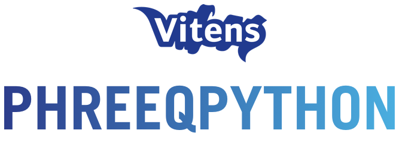

{ .logo-home }

PhreeqPython is an object-oriented Python wrapper around PHREEQC. Solutions, gases, and phases stay in memory as objects that you can change and query from Python.

-   :lucide-book:{ .lg .middle } __Introduction__

    ---

    What PhreeqPython is, how it talks to PHREEQC, and which features are wrapped

    [:lucide-arrow-right: Introduction](introduction/about.md)

-   :lucide-play:{ .lg .middle } __Getting started__

    ---

    Install the package and run your first analysis

    [:lucide-arrow-right: Getting started](getting-started/installation.md)

-   :lucide-beaker:{ .lg .middle } __Examples__

    ---

    Live notebooks you can run in the browser: equilibrium, kinetics, and gases

    [:lucide-arrow-right: Examples](examples/index.md)

-   :lucide-library:{ .lg .middle } __API Reference__

    ---

    Classes and methods: PhreeqPython, Solution, Gas, EquilibriumPhase, VIPhreeqc

    [:lucide-arrow-right: API Reference](reference/index.md)

